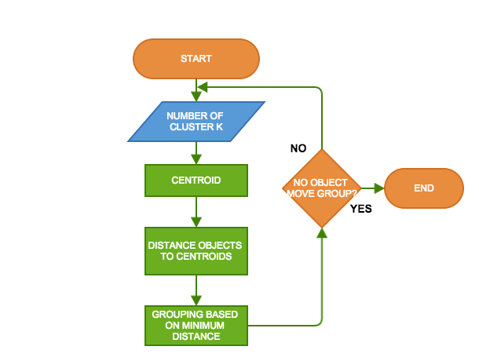
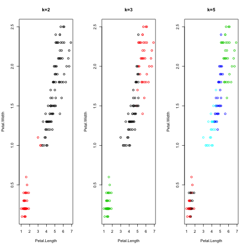

Data Products: K-means Clustering of IRIS data
========================================================
author: Kenneth D. Graves
date: Tue Feb 17 15:54:10 2015
font-import: http://fonts.googleapis.com/css?family=Risque
font-family: 'Risque'

A R Presentation on a **shiny** application prepared for Coursera's Data Products course.  The application allows the selection of number of K clusters on the IRIS data-set to demonstrate the parameter's effect on K-means grouping in R.

K-Means Clustering
========================================================
left: 60%

K-means clustering aims to partition *n* observations into *k* clusters in which each observation belongs to the cluster with the nearest mean, serving as a prototype of the cluster. Given an initial set of centers, the k-means algorithm alternates two steps:

- for each center identify the subset of training points that are closer to them than any other centroid.
- the means each gouping are computed, and this mean vector becomes the new centroid for that cluster.

The steps are iterated until convergance.

***

The IRIS Dataset
========================================================
left: 70%
To demonstrate the inital *k* parameter effect on R's k-means alogorthm, the application uses Edgar Anderson's IRIS dataset.  The data gives the measurements in centimeter of sepal and petal width and length.  The species are *Iris setosa, veriscolor*, and *virginica*.

Here are the actual means of each of the three species:

<table border=1>
<tr> <th>  </th> <th> Species </th> <th> Sepal.Length </th> <th> Sepal.Width </th> <th> Petal.Length </th> <th> Petal.Width </th>  </tr>
  <tr> <td align="right"> 1 </td> <td> setosa </td> <td align="right"> 5.01 </td> <td align="right"> 3.43 </td> <td align="right"> 1.46 </td> <td align="right"> 0.25 </td> </tr>
  <tr> <td align="right"> 2 </td> <td> versicolor </td> <td align="right"> 5.94 </td> <td align="right"> 2.77 </td> <td align="right"> 4.26 </td> <td align="right"> 1.33 </td> </tr>
  <tr> <td align="right"> 3 </td> <td> virginica </td> <td align="right"> 6.59 </td> <td align="right"> 2.97 </td> <td align="right"> 5.55 </td> <td align="right"> 2.03 </td> </tr>
   </table>

***

Three Choices for Number of Cluster Centers
========================================================

Different choices of desired number of cluster centers will group the underlying observations differently:

 

K-means Demonstration Application
=======================================================
left: 50%
Our **shiny** [application](http://majystr.shinyapps.io/Project) allows the observer to see the effect of different number of clusters on groupings of the iris species.  The following tables show the confusion matrices for three such settings: 2, 3, 5.

<!-- html table generated in R 3.1.2 by xtable 1.7-4 package -->
<!-- Tue Feb 17 15:54:10 2015 -->
<table border=1>
<tr> <th>  </th> <th> 1 </th> <th> 2 </th>  </tr>
  <tr> <td align="right"> setosa </td> <td align="right">   0 </td> <td align="right">  50 </td> </tr>
  <tr> <td align="right"> versicolor </td> <td align="right">  47 </td> <td align="right">   3 </td> </tr>
  <tr> <td align="right"> virginica </td> <td align="right">  50 </td> <td align="right">   0 </td> </tr>
   </table>
<!-- html table generated in R 3.1.2 by xtable 1.7-4 package -->
<!-- Tue Feb 17 15:54:10 2015 -->
<table border=1>
<tr> <th>  </th> <th> 1 </th> <th> 2 </th> <th> 3 </th>  </tr>
  <tr> <td align="right"> setosa </td> <td align="right">   0 </td> <td align="right">   0 </td> <td align="right">  50 </td> </tr>
  <tr> <td align="right"> versicolor </td> <td align="right">  48 </td> <td align="right">   2 </td> <td align="right">   0 </td> </tr>
  <tr> <td align="right"> virginica </td> <td align="right">  14 </td> <td align="right">  36 </td> <td align="right">   0 </td> </tr>
   </table>

***

<!-- html table generated in R 3.1.2 by xtable 1.7-4 package -->
<!-- Tue Feb 17 15:54:10 2015 -->
<table border=1>
<tr> <th>  </th> <th> 1 </th> <th> 2 </th> <th> 3 </th> <th> 4 </th> <th> 5 </th>  </tr>
  <tr> <td align="right"> setosa </td> <td align="right">  17 </td> <td align="right">  33 </td> <td align="right">   0 </td> <td align="right">   0 </td> <td align="right">   0 </td> </tr>
  <tr> <td align="right"> versicolor </td> <td align="right">   0 </td> <td align="right">   0 </td> <td align="right">   0 </td> <td align="right">  23 </td> <td align="right">  27 </td> </tr>
  <tr> <td align="right"> virginica </td> <td align="right">   0 </td> <td align="right">   0 </td> <td align="right">  32 </td> <td align="right">  17 </td> <td align="right">   1 </td> </tr>
   </table>

As you can see, the number of *k* is an important parameter in determine accuracy of grouping.  There are advanced techniques to optimally determine these cluster numbers, but they are beyond the scope of this assignment.

In the meantime, please feel free to use this application in all your k-means demonstrations.
